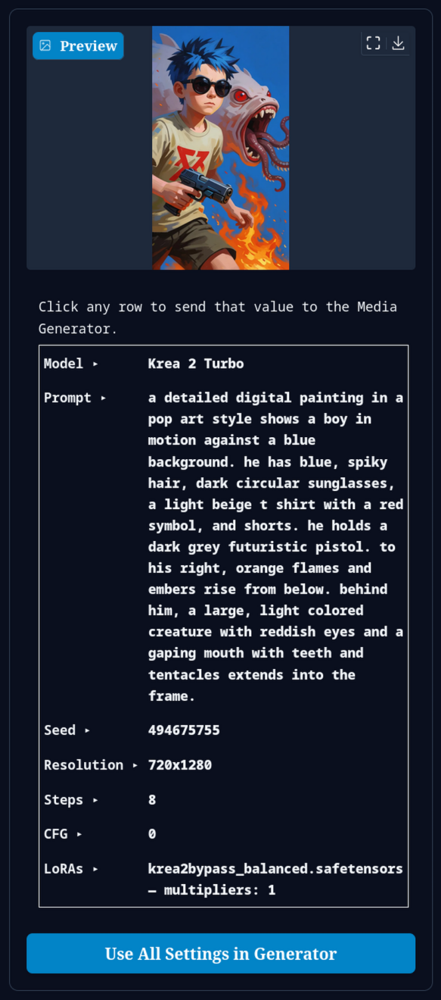
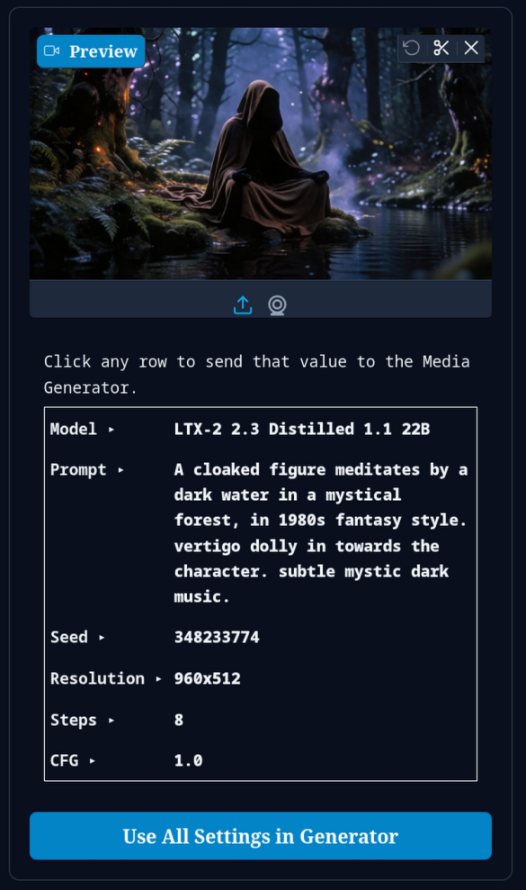

# Prompt Manager for Wan2GP

Browse your generated images and videos, inspect their embedded metadata, and send individual values back to the Media Generator with a single click — similar to reusing prompts and seeds in Midjourney-style workflows.

Works with **both images and videos** that contain WanGP generation metadata.

## Screenshots

Browse your outputs in a thumbnail grid and inspect generation metadata for any selected file:



Click any metadata row to send that value to the Media Generator, or load the full recipe with one button:



## Features

- Grid view of outputs from your configured save folders (with folder navigation)
- Preview panel for the selected image or video
- Click-to-apply metadata fields:
  - **Model**
  - **Prompt**
  - **Seed**
  - **Resolution**
  - **Steps**
  - **CFG**
  - **LoRAs**
- **Use All Settings in Generator** — loads the full generation recipe, including start/end frames when supported by the model
- Independent plugin — does not require the File Gallery plugin

Partial field clicks apply to your **current** model. Clicking **Model** switches to the model used in that generation. **Use All Settings** loads the complete configuration from the file.

## Requirements

- [Wan2GP](https://github.com/deepbeepmeep/Wan2GP) (WanGP / WangP)
- No extra Python dependencies

## Installation

### From the Wan2GP UI (recommended)

1. Open Wan2GP and go to the **Plugins** tab.
2. Under **Install New Plugin**, paste this repository URL:

   ```
   https://github.com/davidbrum25/wan2gp-prompt-manager
   ```

3. Click **Download and Install Plugin**.
4. Enable **Prompt Manager** in the plugin list.
5. **Restart Wan2GP**.

### Manual installation

1. Clone this repository into your Wan2GP `plugins/` folder:

   ```bash
   cd /path/to/Wan2GP/plugins
   git clone https://github.com/davidbrum25/wan2gp-prompt-manager.git
   ```

2. Enable `wan2gp-prompt-manager` in **Plugins** → save settings → restart Wan2GP.

## Usage

1. Open the **Prompt Manager** tab.
2. Click **Refresh Files** to scan your output folders.
3. Select an image or video from the grid.
4. Click any metadata row (e.g. **Prompt ▸**) to send only that value to the Media Generator, or click **Use All Settings in Generator** for the full recipe.

Files without embedded WanGP metadata still show a preview and basic file info, but clickable fields and **Use All Settings** are only available when generation metadata is present.

## Updating

If you installed via the Plugins UI from GitHub, use **Update** on the plugin in the Plugins tab, then restart Wan2GP.

## Author

**David Brum**  
[davidbrum.5@gmail.com](mailto:davidbrum.5@gmail.com)

## License

MIT — see [LICENSE](LICENSE).